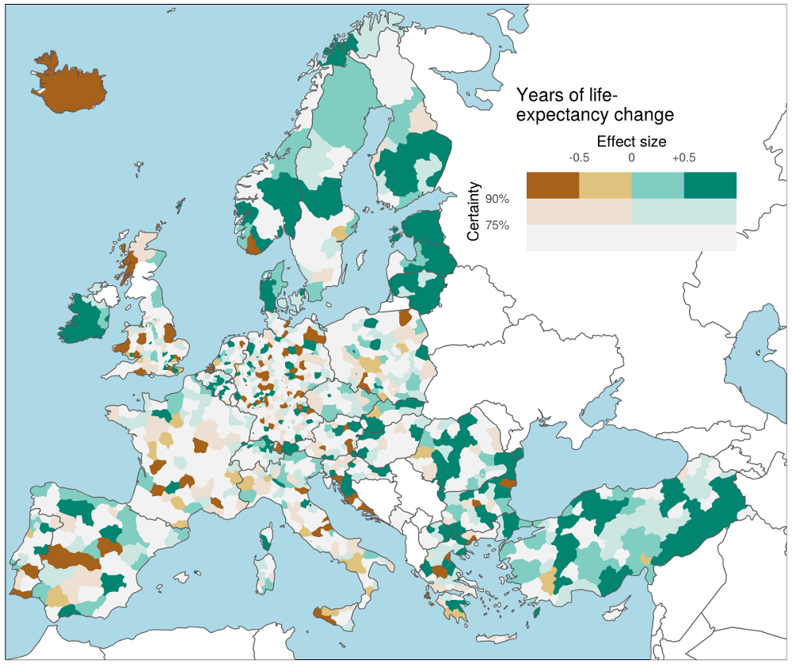

Mapping Uncertainty via Multidimensional Color Scales
================
Jonas Schöley

Materials for the presentation "Mapping Uncertainty via Multidimensional Color Scales" @RostockRetreat2021.

**Change in life-expectancy from 2014 to 2017 across European NUTS-3 regions. "Certainty" represents the probability of direction of change as depicted under repeated Poisson sampling of regional age-specific death counts.**

